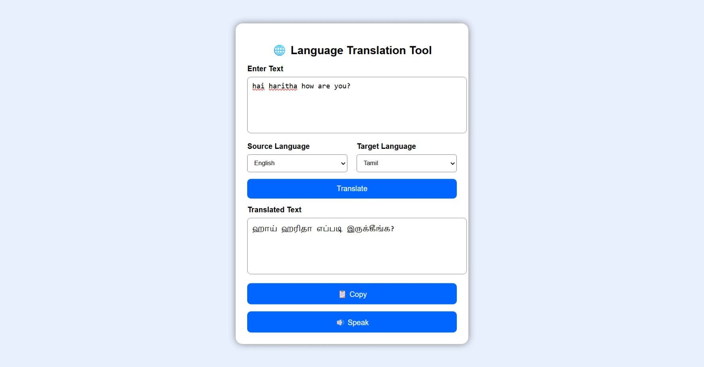

# Language Translation Tool

A web-based application that translates text between multiple languages using a Translation API.

## About the Project

The Language Translation Tool allows users to enter text, select source and target languages, and get translated output instantly. The project provides a simple interface with additional features like copying translated text and text-to-speech.

## Features

- Translate text between multiple languages
- User-friendly interface
- Source and target language selection
- Fast translation using API
- Copy translated text
- Text-to-speech support

## Technologies Used

- HTML
- CSS
- JavaScript
- Translation API

## Project Structure

```
Language-Translation-Tool
│
├── index.html
├── style.css
├── script.js
└── images
    └── output.png
```

## How It Works

1. User enters text.
2. Selects source and target languages.
3. The application sends the request to the Translation API.
4. The translated response is displayed.
5. Users can copy the text or use text-to-speech.

## Output



## Demo Video

[Click Here to Watch Demo](https://drive.google.com/file/d/1BT4oDxtfHC3DdiimsHQSuxqT3B0bYi3R/view?usp=drivesdk)

## How to Run

1. Download or clone the repository.
2. Open the project in Visual Studio Code.
3. Open `index.html`.
4. Run using Live Server.

## Future Enhancements

- Add more language support
- Add voice input feature
- Improve translation accuracy
- Add translation history

## Developer

**Kaviya G**